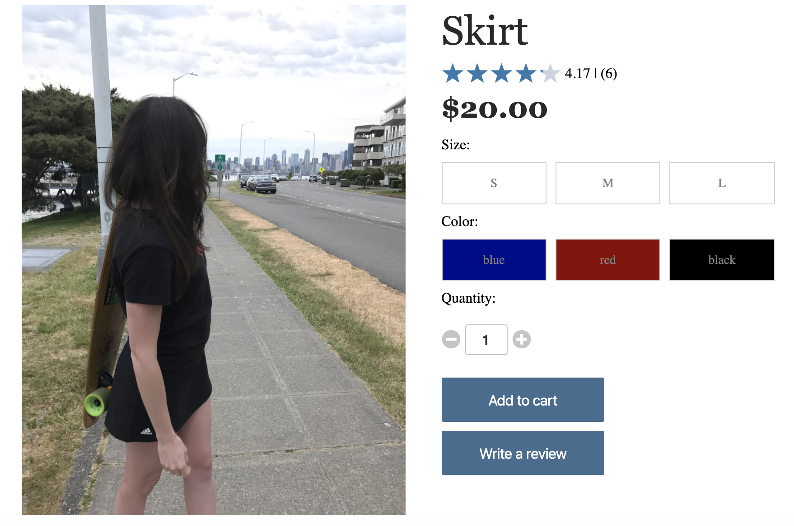
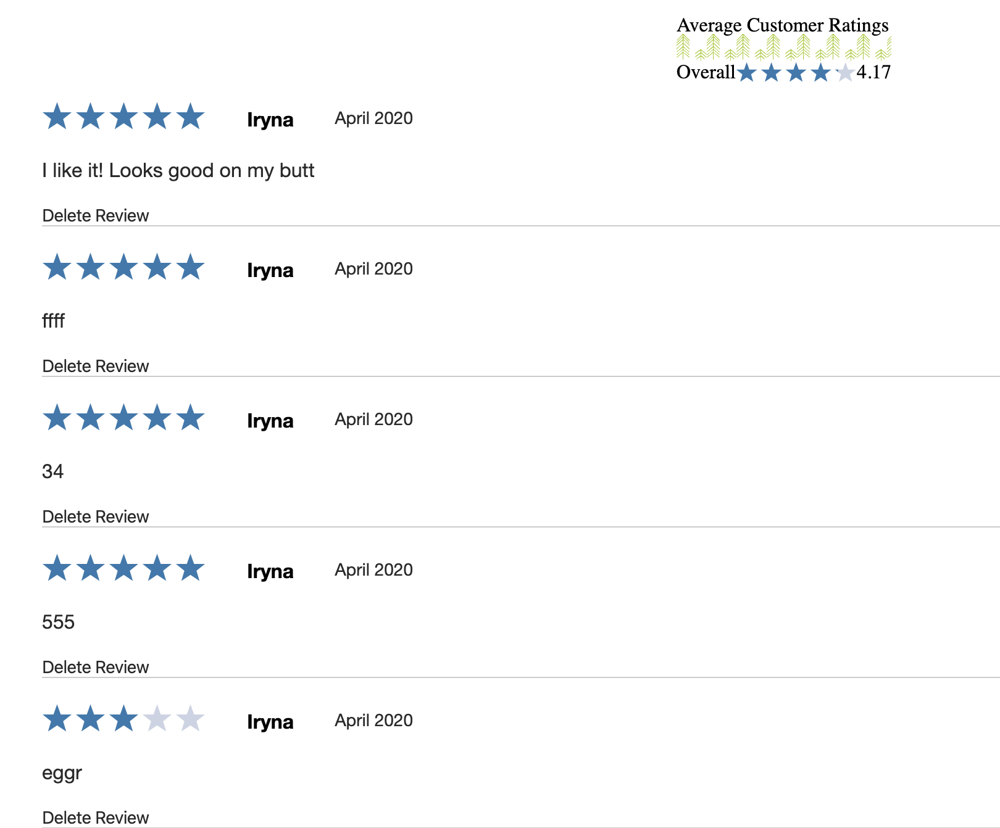

# SO_NORTHWEST

So_northwest is a website that sells sporting goods, camping gear, travel equipment, and clothing. 

See it live: coming soon...


## List of Technologies:

* Front-end:
  - React Hooks
  - Redux Toolkit
  - CSS3
* Back-end:
  - Ruby on Rails
  - PostgreSQL
  - AWS S3

For this project I decided to take a more advanced approach and used React Hooks with Redux Toolkit. 
No more containers, action folders, mapStateToProps, mapDispatchToProps and no more React lifecycle methods! #allgone

## Example

### Users can click on a specific product they would like to purchase, see information about it, leave a review and see a list of all reviews for that product:

```javascript
function Product() {
    const dispatch = useDispatch();
    const [showForm, setShowForm] = useState(false);
    const showReviewForm = () => setShowForm(showForm => !showForm);

    let {productId} = useParams();

    useEffect(() => {
        dispatch(fetchProduct(productId));
    }, [dispatch]);

    const {product, sizes, colors, reviews, userId} = useSelector(state => {

        let productIdx = state.entities.products.products.findIndex(product => product.id === Number(productId));
        let product = state.entities.products.products[productIdx]
        return {
            product: product,
            sizes: state.entities.products.sizes,
            colors: state.entities.products.colors,
            reviews: state.entities.products.reviews,
            userId: state.session.id
    }});
```


Product slice of state:

```javascript
const productSlice = createSlice({
    name: 'products',
    initialState,
    reducers: {
        receiveAllProducts: (state, {payload}) => {
            state.products = Object.values(payload)
        },
        receiveProduct: (state, {payload}) => {
            let product = Object.values(payload.products)[0]
            let i = state.products.findIndex(p => p.id === product.id)
            if (i === -1) {
                state.products.push(product)
            } else  {
                state.products[i] = product
            }
            state.sizes = Object.assign({}, state.sizes, payload.sizes)
            state.colors = Object.assign({}, state.colors, payload.colors)
            state.reviews = Object.assign({}, state.reviews, payload.reviews)
        },
        receiveReview: (state, {payload}) => {
           
            state.reviews = Object.assign({}, state.reviews, payload.reviews)
            let review = Object.values(payload.reviews)[0]
            let i = state.products.findIndex(p => p.id === review.productId)
            if (i !== -1) {
                state.products[i].reviews.push(review.id)
            } 
        }
```


